# OpenCV
## 1.OpenCVとは
<p align="center">


</p>

<br>　OpenCVとはOpenCV(Open Source Computer Vision Library)はIntelが開発した画像・動画に関する処理機能をまとめたオープンソースのライブラリです．
<br>　今回の説明では**python3.14**のバージョンを基に解説している．古いバージョン（**python3.6.7**では今回のプログラムが動かない可能性があるので注意してほしい）．

## 2.OpenCVの入れ方
　OpenCVをPythonで利用する場合にはWindowsでは**pipコマンド**，
macOSではHomebrewを用いて**brewコマンド**です.
<br>pipコマンドの使い方にはターミナルから以下のコードを入力する．

```vim
pip install  opencv-python
```

<br>このコマンドを使うとopencv-pythonだけでなく，numpyもインストールできる．

## 3.OpenCVの基本的な入力動作
### 3-1.画像の読み込み
cv2.imread()を用いると画像の読み込みができる．
imread()の引数は，初めに読み込みたい画像（png,img）を指定し，次に白黒で画像を読み込みたい場合は"**0**",カラーでは"**1**"を指定する．
```python
cv2.imread('画像のjpg,pngファイル',0 or 1)
```
### 3-2.画像の表示
cv2.imshow()を用いると画像の表示ができる.<br>imshow()の引数は，初めに表示したい画像名を指定する．
```python
cv2.imshow('画像の名前（ウィンドウ名）',jpg,pngのファイル)
```
しかしcv2.imshowだけだとすぐにウィンドウが閉じてしまうため，以下のコードを使用する．
```python
cv2.imshow('画像の名前（ウィンドウ名）',jpg,pngのファイル)
cv2.waitKey(0)
cv2.destoryAllWindows()
```
cv2.waitKey(0)は次にキーを入力するまでの停止することをあらわす．
<br>cv2.destroyAllWindows()はウィンドウを全て閉じる動作
<br>実際の**使用例**はこちらである.
<p align="center">
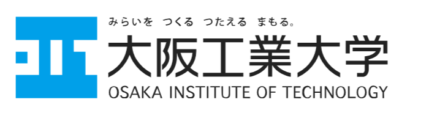
</p>
<br>上記の画像を**グレースケール**で表示するには以下のコードで実行できる．

```python

import numpy as np
import cv2
img0 = cv2.imread('test1.png',0)
cv2.imshow('image',img0)
cv2.waitKey(0) #待機時間
cv2.destroyAllWindows #写真を閉じるためのウィンドウ
```
<br>カラーで表示するには以下のコードで実行できる．

```python
import numpy as np
import cv2
img0 = cv2.imread('test1.png',1)
cv2.imshow('image',img0)
cv2.waitKey(0) #待機時間
cv2.destroyAllWindows #写真を閉じるためのウィンドウ
```

### 3-3.画像の保存
cv2.imwrite()を用いると画像の保存ができる．<br>imwrite()の引数は，保存先のファイル名（パス）と保存する画像データです.

```python
cv2.imwrite('保存先のファイル名'，保存する画像データ)
```

### 3-4.画像のグレースケール化
画像のグレースケール化（白黒）はcv2.cvtColorを用いるとできる．
```python
cv2.cvtCoor('画像の名前',cv2.COLOR_BGR2GRAY)
```

### 3-5.画像のリサイズ
画像のサイズ（縦・横の大きさ）はcv2.resizeを用いると変更できる．
```python
cv2.resize(画像データ，(幅, 高さ))
```


## 4.画像のデータ構造と座標系

　OpenCVの画像処理で，OpenCVで読み込んだ画像は**NumPyの多次元配列**として保持される．<br>
その構成要素は以下のとおりです.

| 用語      |   説明                             |
| ---------          | --------------------------------------- |
| 画素（ピクセル）    |画像を構成する最小単位                  |
| 階調　　　　　　　　　|  各画素は「明るさ」や「色」を示す数値を持っています（通常 0〜255 の 256段階）      |
### 4-1.ディジタル画像
ディジタルでは BGR（B:blue,G;green,R:red） で**加法混色**が用いられる．<br>
ディジタル画像は3次元配列となっており，左上が原点であり，画素を番号で指定できる．それぞれの画素値は256階調（0,255）となっており，**1画素で表せる色数**は8bit×3色=24bitカラー約1677万色（256×256×256）となっている．
<div style="display: flex; justify-content: space-between; align-items: flex-start; gap: 10px;">
  <div>
    画像内の領域指定で，
    <br>・「※」の画素を参照するにはimg[ 0 , 3 , 2 ]で指定する．
    </br>
    <br>・緑チャネル全体を参照するにはimg[ : , : , 1 ]で指定する．
    </br>
    <br>・「*」の部分を参照するにはimg[ 1:3 , 2:4, 0]で指定する．
    </br>
    <br>画像のサイズを知るには「h, w, c, = img.shape」でできる．
    </br>
  </div>
  <p align="center">
  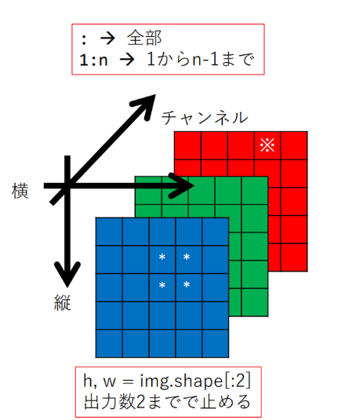
  </p>
</div>

## 5.色空間
### 5-1.BGR色空間（RGB色空間）
 <p align="center">
  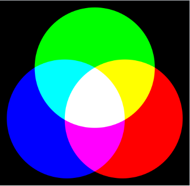
  </p>
  <br>BGR色空間（RGB色空間）は赤色（Red），緑色（Green），青色（Blue）の三色を混ぜた**加法混色**である．用途として有機ELディスプレイや液晶ディスプレイの色の表現方法で用いられる．
  <br>上記の画像は加法混色を表した図である．加法混色ではスクリーンに赤色と緑色，青色の原色を投射すると二次色になり，三原色が適度な割合で混ざると白色になる．(画像はwikipadiaを品用)
  
  <p align="center">
  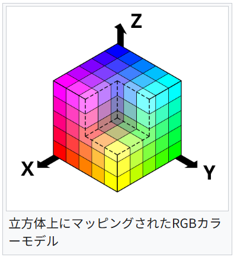
  </p>
  <br>
  上記の図では座標の（x,y,z）はそれぞれ（赤，緑，青）となっている(画像はwikipadiaを品用)．

### 5-2.YUV色空間
Y：輝度(画像の明るさのこと)
<br>
U：B信号（青色）から輝度Yを差し引いた値

V：R信号（赤色）から輝度Yを差し引いた値
```python
import cv2

# 画像の読み込み
img = cv2.imread("test1.png")

# BGR → YUV
img = cv2.cvtColor(img, cv2.COLOR_BGR2YUV)

# Y, U, Vチャンネルに分離
Y, U, V = cv2.split(img)

# 各チャンネルを表示
cv2.imshow("Y Channel", Y)
cv2.imshow("U Channel", U)
cv2.imshow("V Channel", V)

cv2.waitKey(0)
cv2.destroyAllWindows()
```
<br>上記のコードはYチャネルとUチャネル，Vのチャネルを表示する画像である．
<div style="display: flex; justify-content: space-between; align-items: flex-start; gap: 10px;">


</div>
<br>上記の赤いロゴと青いロゴからYUV色空間のチャネルごとの画像を作成した.
<div style="display: flex; justify-content: space-between; align-items: flex-start; gap: 10px;">
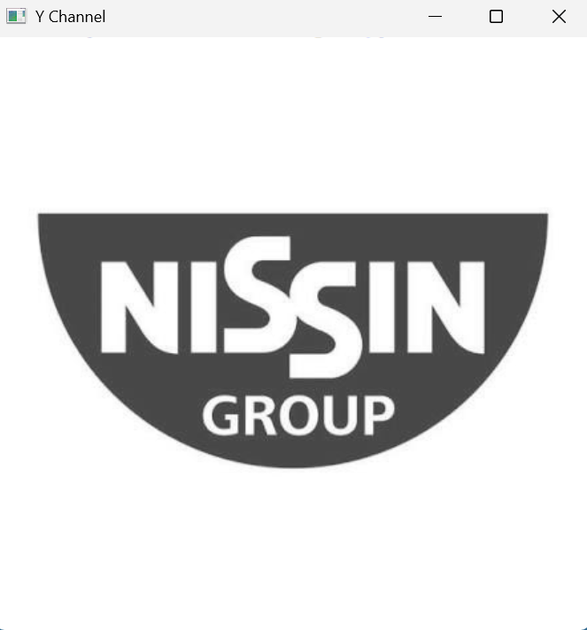
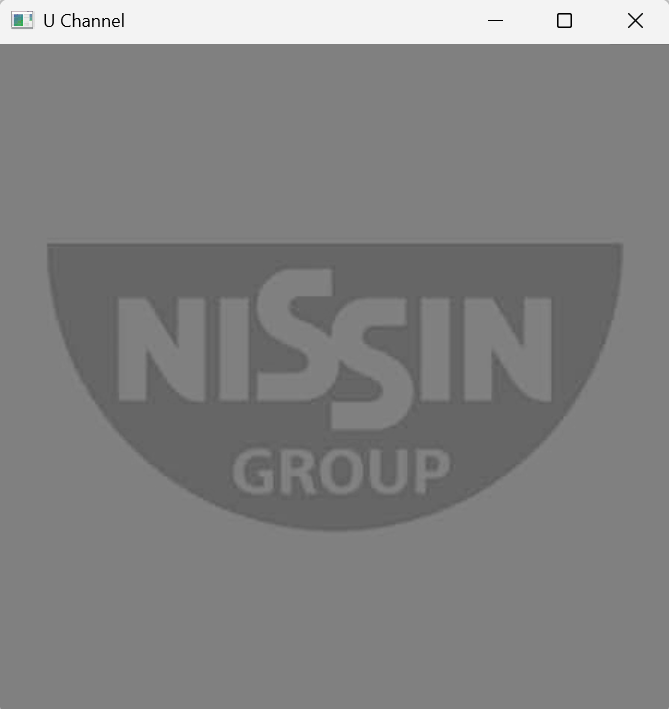
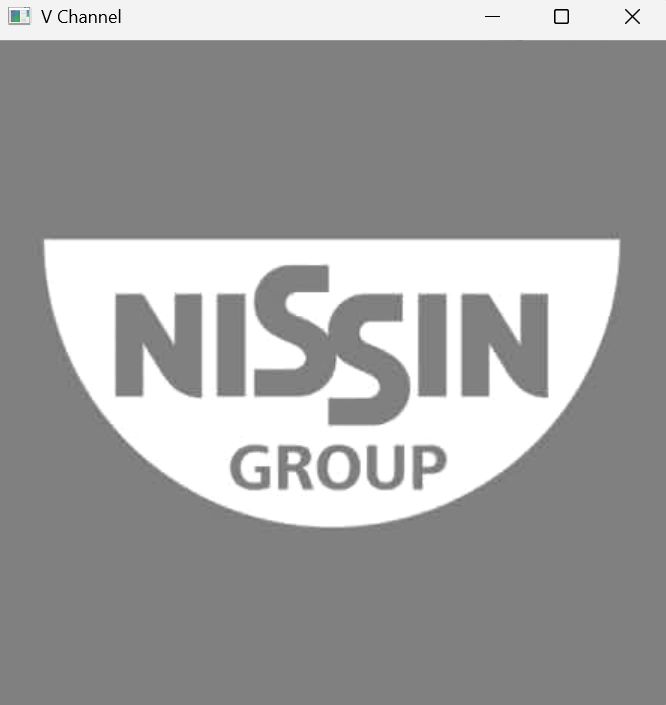
</div>
<br>上記は赤色ロゴのYチャネル，Uチャネル，Vチャネルを表示したものである．
一番右側のVチャネルのロゴに注目してほしい．Vチャネルは赤色が強調されるため，ロゴの赤色の部分が白くなっている．一方，中央のUチャネルでは青色が強調されるため，ロゴに青色の部分が含まれていない限り，全体的に黒く表示される．
<div style="display: flex; justify-content: space-between; align-items: flex-start; gap: 10px;">
 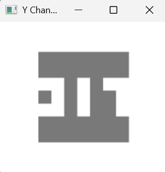
 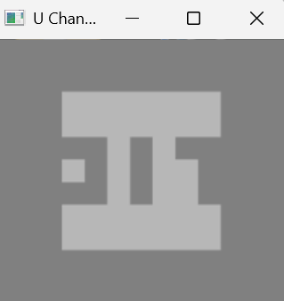
 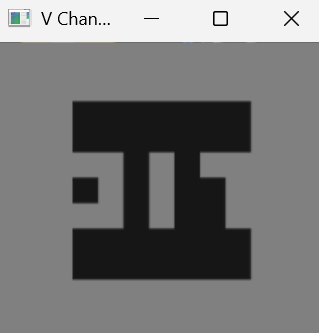
</div>

<br>上記は青色ロゴのYチャネル，Uチャネル，Vチャネルを表示したものである．
<br>中央のロゴに注目してほしい．中央のUチャネルは青色が強調されるのでロゴの青色の部分が少し白くなっている．一方右側のロゴでは赤色の部分が含まれていない限り全体的に黒く表示される．
<br>YUV色空間では各チャネルの値は0～255となっている

### 5-3.Lab色空間
<p align="center">
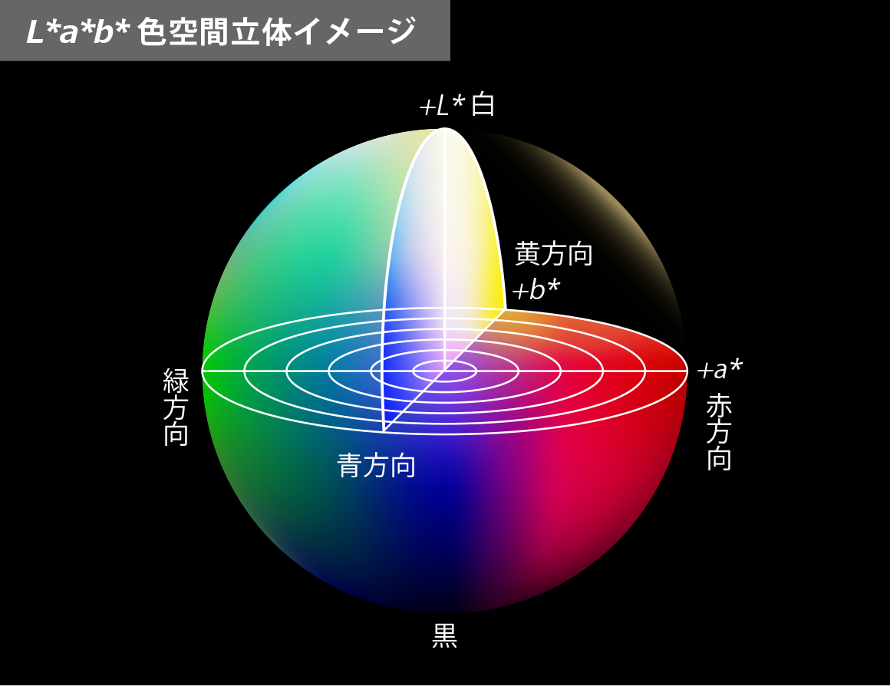
</p>

<br>Lab色空間はRGBやYUVとは異なり，**明るさ**や**色**を分けて表現する．


| チャネル      |   説明                             |
| ---------          | --------------------------------------- |
| H     |明度 <br>レンジは0~100である．例えば0は完全な黒，100は完全な白色を示す．                 |
| S 　　　　　　　　　| （負）緑-マゼンタ（正）の色成分<br>レンジは-100~100 |
| V                 | （負）青-黄（正）の色成分<br>レンジは-100~100 |

### 5-4.HSV色空間

<p align="center">
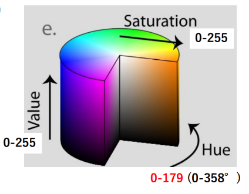
</p>

　HSV色空間とは，Hチャネルが**色相**，Sチャネルが**彩度**，Vチャネルが**明度**で構成されている．HSV色空間は色が角度で指定できるので，使いやすいメリットがある．

#### 5-4-1.色相
色相は，赤や緑などの具体的な色を定義する要素で，0°～360°の範囲で表されられる．[1]
<p align="center">
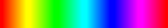
<br>0°-------------->360°
</p>

<br>　上記の図では色相の値が何色になるかを表している．
<br>　色相の範囲は

#### 5-4-2.彩度
彩度は，色相の色の鮮やかさ・濃さを表す要素で，0%～100%の範囲で表される．100%が最も色が濃く，彩度の減少に合わせて色が薄くなり，0%の状態では灰色になる．HSV色空間の場合は彩度が低下すると，赤色と，緑色，青色の最も強い成分に収束していく[1]．

<p align="center">

<br>0%-------------->100%
</p>

#### 5-4-3.明度
<br>　明度とは，色相で定義された色の**明るさ**や**暗さ**を表す要素であり，0～100%の範囲で表される．最も明るいのが100%で，明度の減少に合わせて暗くなっていき，0%で黒色になる[1]．

<p align="center">
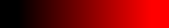
<br>0%-------------->100%
</p>

<br>　HSV色空間の場合，赤色と緑色，青色の成分のうちどれか1つが**最大**の場合，つまり，RBGでの各チャネルの値では255階調の場合は必ず明度100%になる．

#### 5-4-4. HSV色空間のまとめ
　そのため，明度の調整だけでは赤色RGB(255,0,0)からさらに明るくすることが不可能になるため，彩度の調整が必要になる．そこで彩度の調整を組み込んだ**HSL空間**というものが存在する．

| チャネル      |   説明                             |
| ---------          | --------------------------------------- |
| H     |色相．階層は0°～360°．何色かを表す．      |
| S　　　　　　　　　| 彩度．階層は0～100%，色の鮮やかさを表す． |
| V                 | 明度．階層は0～100%．色の明るさを表す． |

### 5-5.　OpenCVでの実装
　HSVでは，画像から特定の色範囲だけを取り出すプログラムが良く使われる．この処理は**クロマキー処理**で重宝される．
<br>　以下のプログラムで実際に実行してみる．

```python
import cv2
import numpy as np

# 1. 画像の読み込み
image = cv2.imread('youkai.jpg')

# 2. BGRからHSV空間へ変換
# ※OpenCVでは標準がBGR形式で、Hの範囲は 0〜179 に変換されます
hsv = cv2.cvtColor(image, cv2.COLOR_BGR2HSV)

# 3. 抽出したい色の範囲を指定（例：赤色）
# 赤色はHue（色相）の0付近と170付近の両方にまたがるため、2つの領域を指定して結合します
lower_red1 = np.array([0, 100, 100])
upper_red1 = np.array([10, 255, 255])

lower_red2 = np.array([170, 100, 100])
upper_red2 = np.array([179, 255, 255])

# 4. マスク画像の作成（範囲内の画素を255、範囲外を0に）
mask1 = cv2.inRange(hsv, lower_red1, upper_red1)
mask2 = cv2.inRange(hsv, lower_red2, upper_red2)
mask = cv2.bitwise_or(mask1, mask2) # 2つのマスクを結合

# 5. 元画像にマスクを適用して指定色だけを抽出
result = cv2.bitwise_and(image, image, mask=mask)

cv2.imshow('Result', result)
cv2.waitKey(0)
```
<br>上記のプログラムは画像から赤色のマスクを指定し，赤色だけの画像を出力している．

<p align="center">

</p>
実際に上記の画像で実行すると，以下のようになる．
<p align="center">
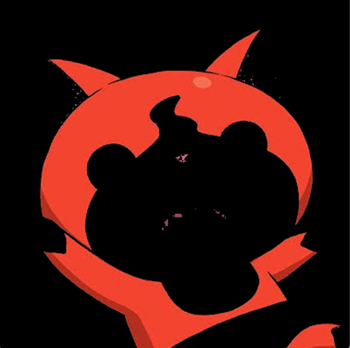
</p>
<br>　上記の画像でさらに白色や水色のマスクを作り，キャラクターを以下のコードで取り出すと．

```python
import cv2
import numpy as np

# 1. 画像の読み込み
image = cv2.imread('youkai.jpg')

# 2. BGRからHSV空間へ変換
# ※OpenCVでは標準がBGR形式で、Hの範囲は 0〜179 に変換されます
hsv = cv2.cvtColor(image, cv2.COLOR_BGR2HSV)

# 3.1 抽出したい色の範囲を指定（例：赤色）
# 赤色はHue（色相）の0付近と170付近の両方にまたがるため、2つの領域を指定して結合します
lower_red1 = np.array([0, 100, 100])
upper_red1 = np.array([10, 255, 255])

lower_red2 = np.array([170, 100, 100])
upper_red2 = np.array([179, 255, 255])

# 3.2 抽出したい色の範囲を指定（例：黄色）
lower_yellow = np.array([20, 92, 100])
upper_yellow = np.array([30, 255, 255])

# 3.3 抽出したい色の範囲を指定（例：黒色）
lower_black = np.array([0, 0, 0])
upper_black = np.array([179, 255, 70])

# 3.4 抽出したい色の範囲を指定（例：白色）
lower_white = np.array([0, 0, 170])
upper_white = np.array([179, 50, 255])

# 3.5 抽出したい色の範囲を指定（例：ピンク色）
lower_pink = np.array([160, 100, 90])
upper_pink = np.array([179, 255, 255])

# 3.6 抽出したい色の範囲を指定（例：水色）
lower_cyan = np.array([82, 100, 150])
upper_cyan = np.array([89, 169, 250])

# 4. マスク画像の作成
mask1 = cv2.inRange(hsv, lower_red1, upper_red1)
mask2 = cv2.inRange(hsv, lower_red2, upper_red2)
mask12 = cv2.bitwise_or(mask1, mask2) # 2つのマスクを結合

mask3 = cv2.inRange(hsv, lower_yellow, upper_yellow)
mask123 = cv2.bitwise_or(mask12, mask3) # 赤と黄色のマスクを結合

mask4 = cv2.inRange(hsv, lower_black, upper_black)
mask1234 = cv2.bitwise_or(mask123, mask4) # 赤、黄色、黒のマスクを結合

mask5 = cv2.inRange(hsv, lower_white, upper_white)
mask12345 = cv2.bitwise_or(mask1234, mask5) # 赤、黄色、黒、白色のマスクを結合

mask6 = cv2.inRange(hsv, lower_pink, upper_pink)
mask123456 = cv2.bitwise_or(mask12345, mask6) # 赤、黄色、黒、白色、ピンク色のマスクを結合

mask7 = cv2.inRange(hsv, lower_cyan, upper_cyan)
mask1234567 = cv2.bitwise_or(mask123456, mask7) # 赤

result = cv2.bitwise_and(image, image, mask=mask1234567)

cv2.imshow('Result', result)
cv2.waitKey(0)
```

<br>以下の画像のようにキャラクターだけを画像から引き抜くことができる．

<p align="center">

</p>


## 参考文献
* [1]: [PEKO STEP（HSV色空間）](https://www.peko-step.com/html/hsv.html)
